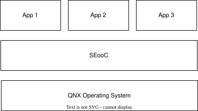
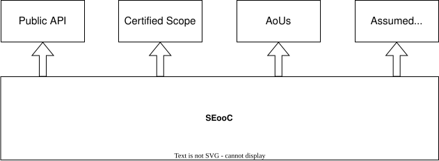

..
   # *******************************************************************************
   # Copyright (c) 2026 Contributors to the Eclipse Foundation
   #
   # See the NOTICE file(s) distributed with this work for additional
   # information regarding copyright ownership.
   #
   # This program and the accompanying materials are made available under the
   # terms of the Apache License Version 2.0 which is available at
   # https://www.apache.org/licenses/LICENSE-2.0
   #
   # SPDX-License-Identifier: Apache-2.0
   # *******************************************************************************

Overview
========

What is a Dependable Element?
------------------------------

A :ref:`dependable_element <rule-dependable-element>` assembles the framework of a
**Safety Element out of Context (SEooC)** as defined by ISO 26262 — a safety
element that is developed and verified independently of a concrete project. This means that
it provides both an implementation and the required safety documents and artifacts
for a specific safety-relevant function.

To enable this, assumptions on the surrounding system (context) must be taken. Those
assumptions are captured as :ref:`assumed_system_requirements <Assumed System Requirements>`.
In Combination with the Assumed System, the inputs to the dependable element are defined:

But not everything can be guaranteed by the element's own implementation
— whatever falls outside its scope of responsibility (or cannot be implemented
by the element itself) is instead exposed as
Assumptions of Use that the integrating project must satisfy. It is the same for the other
SEooCs that the dependable element itself depends on. The SEooCs which are integrated also provide their own Assumptions of Use, which either must be satisfied or forwarded to the next level of integration.

Alongside the context for documentation a context for the source files also needs to be defined. This
is achieved by exposing also the covered sources files as bazel scope. So on a top level
it can be verified that each dependency which is used in the project is also covered by a dependable element.

On an abstract level, a SEooC therefore exposes following interfaces to the outside world:

See :doc:`user_guide/general` for the underlying concept.

Concept Behind Rules SCORE
--------------------------

``rules_score`` keep requirements, architecture and safety analysis as plain files living next to
implementation and tests which they describe. Traceability between the distinct files is performed
in Bazel as the Buildsystem using the bazel dependency graph itself:

an ``architectural_design`` target only
"knows" about the ``unit``/``component`` targets it lists, a ``unit`` only
compiles the ``implementation`` files it declares, and a ``dependable_element``
only assembles the targets reachable through its own attributes.

Every ``.. uml::`` diagram, ``.trlc`` requirement, and safety-analysis file is a build input
like any other source file, so any change to it is picked up by the next ``bazel
build``/``bazel test`` automatically - using bazel caching for efficient builds.

This file-based, build-intrinsic approach gives two things for free that a
separate documentation/traceability tool would otherwise have to reconstruct:

- **Consistency at build time** — see :ref:`Automatic Checks <automatic-checks>`
  below: because every artefact is a target, Bazel already knows exactly which
  units, components, and diagrams belong together, so cross-checking them is
  just another build/test action.
- **Leverage Bazel Action Graph** — because every check is an ordinary action
  with declared inputs/outputs, Bazel's incremental build and (remote) caching
  apply to it just like to a compile step: changing one requirement file only
  re-runs the validations whose inputs actually changed, unaffected
  units/components are served from cache, and the same graph scales to remote
  execution without any extra plumbing.

.. _automatic-checks:

Automatic Checks
-----------------

Requirements (test)
~~~~~~~~~~~~~~~~~~~~

For every ``assumed_system_requirements``/``feature_requirements``/``component_requirements``
target two layers of checks apply:

- **TRLC intrinsic checks** — syntax errors, wrong field types, missing mandatory
  fields, unknown fields, enum/array-cardinality violations, and broken
  cross-references including versioning
- **S-CORE requirements model**  enforces the
  derivation chain ``AssumedSystemReq → FeatReq → CompReq``, requires an ``Asil`` safety
  classification and defines the safety-analysis
  vocabulary (``FailureMode`` with HAZOP ``Guideword``\ s, ``ControlMeasure``,
  ``AoU``) used by ``fmea``/``assumptions_of_use``.

Architecture consistency (build)
~~~~~~~~~~~~~~~~~~~~~~~~~~~~~~~~~

Four design layers are cross-checked against each other and against the actual
Bazel/C++ implementation:

.. uml:: _assets/seooc_architecture_validation.puml
   :align: center
   :width: 100%

- **Bazel ↔ static design** — every ``component``/``unit`` target must appear in
  the static PlantUML diagram and vice versa
  (:doc:`spec <tool_reference/specs/bazel_component>`).
- **Static ↔ public/internal API** — interfaces referenced in the static design
  must be declared by the public/internal API class diagrams
  (:doc:`public API spec <tool_reference/specs/component_public_api>`,
  :doc:`internal API spec <tool_reference/specs/component_internal_api>`).
- **Static ↔ dynamic design** — sequence-diagram participants and interface
  connections must match the static design's units and their interfaces
  (:doc:`spec <tool_reference/specs/component_sequence>`).
- **Dynamic ↔ internal API** — every sequence-diagram call must exist on the
  target interface (including cross-unit call roles); interface methods should
  be exercised somewhere
  (:doc:`spec <tool_reference/specs/sequence_internal_api>`).
- **Design ↔ implementation** — unit design class diagrams (types, members,
  methods, enum literals, relationships) must match the generated C++
  implementation model
  (:doc:`spec <tool_reference/specs/class_design_implementation>`).
- **Public API ↔ failure modes** — every public API interface item must be
  referenced by a ``FailureMode`` (via ``FailureMode.interface``) in the
  SEooC's own safety analysis; unreferenced interfaces fail traceability
  (:doc:`spec <user_guide/dependability_analysis>`).

Certified scope (build)
~~~~~~~~~~~~~~~~~~~~~~~~

Every Bazel target transitively reachable through ``unit.implementation`` must
fall inside the package tree declared by this element's own ``unit``/``component``
scope — uncertified external dependencies are rejected, and the same scope may
not be declared twice (:doc:`spec <tool_reference/scope_check>`).

.. uml:: _assets/scope_check.puml
   :align: center
   :width: 100%

Integrity level (build)
~~~~~~~~~~~~~~~~~~~~~~~~

A ``dependable_element`` must not depend (``deps``) on another with a *lower*
``integrity_level``.

Test case coverage (build)
~~~~~~~~~~~~~~~~~~~~~~~~~~~~~~~~

Every ``component`` can declare that its test cases completely cover its requirements.
Coverage is defined by commiting a lockfile containing all test specifications and requirement IDs.
During build it is validated that the test spec was not altered or links were changed.
(:doc:`spec <tool_reference/test_case_coverage>`).

Traceability (test)
~~~~~~~~~~~~~~~~~~~~

``bazel test`` runs ``lobster-ci-report`` over the merged requirement /
architecture / test / safety-analysis graph — assumed-system and feature
requirements, component requirements, architecture, public API, unit tests,
failure modes, control measures, root causes, and AoUs — and fails if any item
lacks full up/down traceability.

.. graphviz::

   digraph tracing_policy {
      rankdir=TB;
      node [shape=box, style=filled, fontname="Helvetica", margin="0.3,0.1"];
      edge [arrowhead=open];

      "Feature Requirements" [fillcolor="#2196F3", fontcolor="white"];
      "Received AoUs" [fillcolor="#2196F3", fontcolor="white"];
      "Forwarded AoUs" [fillcolor="#2196F3", fontcolor="white"];
      "Component Requirements" [fillcolor="#2196F3", fontcolor="white"];
      "Unit Test" [fillcolor="#FF9800", fontcolor="white"];
      "Test Case Coverage" [fillcolor="#FF9800", fontcolor="white"];
      "Architecture" [fillcolor="#4CAF50", fontcolor="white"];
      "Public API" [fillcolor="#4CAF50", fontcolor="white"];
      "Failure Modes" [fillcolor="#2196F3", fontcolor="white"];
      "Control Measures" [fillcolor="#2196F3", fontcolor="white"];
      "Root Causes" [fillcolor="#FF9800", fontcolor="white"];
      "Forwarded AoUs" -> "Received AoUs";
      "Component Requirements" -> "Feature Requirements";
      "Component Requirements" -> "Received AoUs";
      "Unit Test" -> "Component Requirements";
      "Test Case Coverage" -> "Component Requirements";
      "Architecture" -> "Component Requirements";
      "Failure Modes" -> "Public API";
      "Root Causes" -> "Failure Modes";
      "Root Causes" -> "Control Measures";
   }

Execution Overview (Current Behavior)
-------------------------------------

The table below summarizes how checks are currently executed in practice
(build-time action/analysis-time check vs. test-time executable).

.. list-table::
   :header-rows: 1
   :widths: 26 16 58

   * - Check
     - Trigger
     - Current execution path
   * - Requirements validation (TRLC + model)
     - test
     - Executed by generated ``<requirements_target>_test`` targets
       (``trlc_requirements_test``); not run implicitly by building only the
       enclosing ``dependable_element`` target.
   * - Architecture consistency
     - build
     - Validation actions run in ``architectural_design``, ``unit``, and
       ``dependable_element`` index assembly; build fails on violations
       (or warns in ``maturity = "development"``).
   * - Certified scope
     - build
     - Checked during dependable-element index analysis/assembly by traversing
       transitive implementation dependencies against declared certified scopes.
   * - Integrity level
     - build
     - Checked during dependable-element index analysis: a dependable element
       must not depend on a lower-integrity dependable element.
   * - Test case coverage lock
     - build
     - Per-component build action runs when the component provides
       ``test_case_coverage_lock`` metadata; compares current gtest traceability
       view against committed lock state.
   * - Traceability report generation
     - build
     - LOBSTER config/report/RST artifacts are generated during build whenever
       traceability inputs are present.
   * - Traceability enforcement (``lobster-ci-report``)
     - test
     - Executed by ``bazel test`` on the dependable-element test target, using
       the pre-built LOBSTER report.
   * - Unit test execution used as traceability input
     - build
     - Unit test executables are run during build to collect gtest XML that is
       converted into test traceability artifacts.

Provider/log propagation used by dependable_element
~~~~~~~~~~~~~~~~~~~~~~~~~~~~~~~~~~~~~~~~~~~~~~~~~~~

- ``ArchitecturalDesignInfo.validation_logs``: architectural-design validation
  logs are forwarded and re-exposed under the dependable-element validation
  output directory.
- ``UnitInfo.validation_log``: per-unit validation logs are forwarded and
  symlinked into dependable-element outputs.
- ``ComponentTestCaseCoverageInfo``: presence of coverage-lock metadata on a
  component enables the dependable-element-level coverage-lock build action.
- ``OutputGroupInfo(debug)``: dependable-element collects validation logs into a
  debug output group, while still wiring required validation artifacts into
  normal build outputs.

Notes
~~~~~

- ``dependable_element(tests = [...])`` is currently a documented attribute,
  but is not used to execute additional tests by the dependable-element rule
  implementation.
- ``component(tests = [...])`` is currently declared, while traceability input
  generation is driven by nested ``unit`` test artifacts.

Quick Reference
---------------

.. list-table::
   :header-rows: 1
   :widths: 28 20 52

   * - Rule
     - Category
     - User Guide
   * - :ref:`sphinx_module <rule-sphinx-module>`
     - Documentation
     - :doc:`integration_guide`
   * - :ref:`filter_execpath <rule-filter-execpath>`
     - Documentation
     - :ref:`Rule reference <rule-filter-execpath>` *(advanced)*
   * - :ref:`assumed_system_requirements <rule-assumed-system-req>`
     - Artifact
     - :doc:`user_guide/requirements`
   * - :ref:`feature_requirements <rule-feature-requirements>`
     - Artifact
     - :doc:`user_guide/requirements`
   * - :ref:`component_requirements <rule-component-requirements>`
     - Artifact
     - :doc:`user_guide/requirements`
   * - :ref:`assumptions_of_use <rule-assumptions-of-use>`
     - Artifact
     - :doc:`user_guide/assumptions_of_use`
   * - :ref:`glossary <rule-glossary>`
     - Artifact
     - :ref:`Rule reference <rule-glossary>`
   * - :ref:`architectural_design <rule-architectural-design>`
     - Artifact
     - :doc:`user_guide/architectural_design`
   * - :ref:`unit_design <rule-unit-design>`
     - Artifact
     - :doc:`user_guide/unit_design`
   * - :ref:`fmea <rule-fmea>`
     - Artifact
     - :doc:`user_guide/dependability_analysis`
   * - :ref:`dependability_analysis <rule-dependability-analysis>`
     - Artifact
     - :doc:`user_guide/dependability_analysis`
   * - :ref:`unit <rule-unit>`
     - Structural
     - :doc:`user_guide/architectural_design`
   * - :ref:`component <rule-component>`
     - Structural
     - :doc:`user_guide/architectural_design`
   * - :ref:`dependable_element <rule-dependable-element>`
     - Structural
     - :doc:`user_guide/general`

.. seealso::

   :doc:`User Guide <user_guide/index>` — step-by-step guides for every rule

   :doc:`Rule Reference <rule_reference>` — complete attribute reference for all rules
