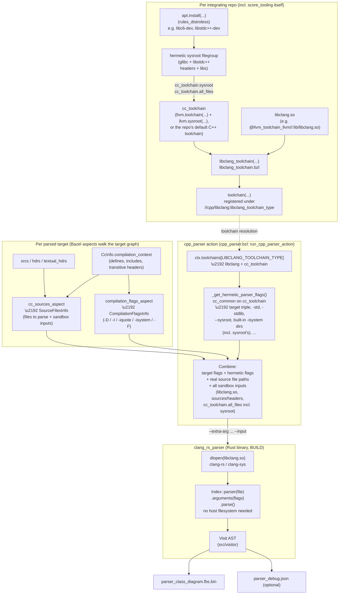

<!-- ----------------------------------------------------------------------------
  Copyright (c) 2026 Contributors to the Eclipse Foundation

  See the NOTICE file(s) distributed with this work for additional
  information regarding copyright ownership.

  This program and the accompanying materials are made available under the
  terms of the Apache License Version 2.0 which is available at
  https://www.apache.org/licenses/LICENSE-2.0

  SPDX-License-Identifier: Apache-2.0
----------------------------------------------------------------------------- -->

# Run C++ parser targets

## Architecture

The parser turns a Bazel C/C++ target into a class-diagram FlatBuffer by
running [libclang](https://clang.llvm.org/docs/Tooling.html) in-process inside
a small Rust binary (`clang_rs_parser`, via the [`clang`](https://docs.rs/clang)
/ `clang-sys` crates). Getting libclang the right compiler flags is the hard
part, so the pieces below exist to derive those flags *hermetically* — from
Bazel's own C++ toolchain model — rather than by hand-coding an LLVM
installation's file layout.

score_tooling deliberately does not hard-code or ship a specific
libclang/compiler for its consumers. Each repository that wants to use the
parser (including score_tooling's own build) registers its **own**
`libclang_toolchain`, so it controls exactly which libclang build and which
`cc_toolchain` (its normal C++ toolchain, or a dedicated LLVM dev dependency)
the parser resolves against. This is why the parser's flags aren't a fixed
list in this repo: they are re-derived per integrating repo from whatever
`cc_toolchain` that repo points at.

### Where each part is collected from

| Part | Collected from | Why |
|---|---|---|
| Source/header files to parse (`SourceFilesInfo`) | Walking the target's `srcs`/`hdrs`/`textual_hdrs` attrs *and* its `CcInfo.compilation_context.headers` (`cc_sources_aspect` in `cpp_parser.bzl`) | The action runs fully sandboxed (no `no-sandbox` escape hatch), so every header libclang might read — including third-party deps' generated `_virtual_includes` symlink trees — must be a declared Bazel input, not just ambient filesystem state. |
| Target-specific compile flags: `-D`, `-I`, `-iquote`, `-isystem`, `-F` (`CompilationFlagsInfo`) | The target's own `CcInfo.compilation_context` (defines, include dirs), transitively across `deps` (`compilation_flags_aspect`) | These are *what makes this specific library's code compile* — its own defines and its dependencies' include paths — independent of which compiler is used. |
| Hermetic toolchain flags: target triple, `-std`, `-stdlib`, hardening/warning flags, `-isystem` for built-in libc++/resource-dir headers | The registered `cc_toolchain`, via `cc_common.configure_features()` / `create_compile_variables()` / `get_memory_inefficient_command_line()` against `ACTION_NAMES.cpp_header_parsing` (`_get_hermetic_parser_flags` in `cpp_parser.bzl`) | Reuses the *exact* flags Bazel's own C++ compile actions would use for that toolchain, so the parser automatically stays correct if the toolchain's flags change, instead of a second, hand-maintained copy drifting out of sync. |
| `libclang.so` + the clang `cc_toolchain` reference (`LibclangToolchainInfo`) | The `libclang_toolchain` rule (`libclang_toolchain.bzl`), registered per integrating repo via `toolchain(... toolchain_type = "//cpp/libclang:libclang_toolchain_type")` | Bazel's standard toolchain-resolution indirection: `cpp_parser` never hard-codes a libclang/cc_toolchain label, it asks for whatever the consuming repo registered. |
| Sandbox inputs for the compiler itself (headers, runtime libs, sysroot) | `cc_toolchain.all_files` | Needed so libclang can actually read its own bundled libc++/resource-dir headers and the sysroot's libc/libstdc++ headers inside the sandbox. |

> **Hermetic sysroot.** score_tooling's own `llvm.toolchain(...)` in
> `MODULE.bazel` is paired with an `llvm.sysroot(...)` call pointing at a
> Bazel-fetched sysroot (glibc + libstdc++ headers/libs, built via
> `rules_distroless`'s `apt.install(...)`/`apt.sysroot(...)`), the same
> pattern `eclipse-score-communication2` uses for its
> `ubuntu24_04_sysroot_amd64` target. This means clang no longer falls back to
> whatever headers/libs happen to be visible on the host at `/usr/include`,
> `/usr/local/include`, etc. — those paths are not declared Bazel inputs and
> disappear under RBE or a hermetic sandbox
> (`--experimental_use_hermetic_linux_sandbox`). No change was needed in
> `cpp_parser.bzl` for this: the hermetic flag derivation already asks the
> registered `cc_toolchain` for its `sysroot`/`built_in_include_directories`
> via `cc_common` and picks up the `--sysroot=...` flag and the sysroot's
> include dirs automatically, exactly like it already does for
> `-std`/`-stdlib`/target-triple flags.

One quirk is compensated for in `_get_hermetic_parser_flags` because
libclang.so is `dlopen()`'d in-process by `clang_rs_parser` rather than
executed as the `clang` driver binary: some `cc_toolchain`s embed the
translation unit's own source file directly in the `cpp_header_parsing`
action's flags — either as a `-c <source_file>` pair (`toolchains_llvm` <
1.8.0) or as a bare positional argument (`toolchains_llvm` >= 1.8.0).
`clang-rs` already supplies the real file separately via the libclang API, so
both forms are stripped (`_strip_source_file_flag`) — left in, libclang treats
the translation unit as specified twice and fails with an AST-deserialization
error (`CXError_ASTReadError`).

A real `clang` binary also auto-detects its resource-dir/libc++/sysroot
headers relative to its own on-disk path. Since libclang.so is loaded by the
Rust binary instead, that auto-detection resolves relative to the *Rust
binary's* path and silently fails to find headers like `<vector>`. `-isystem`
is appended explicitly for each of `cc_toolchain.built_in_include_directories`
(which includes the sysroot's own include dirs once one is configured) to
compensate.



## Configure a parser target in `BUILD`

If you want to parse a specific Bazel target, use the `cpp_parser(...)` rule in the `BUILD` file like:

```
load("//cpp/libclang:cpp_parser.bzl", "cpp_parser")

cpp_parser(
  name = "cpp_parser_include_3rdparty",
  emit_debug_json = True,
  extra_args = [
  ],
  target = "//cpp/libclang/integration_test/cases/include_3rdparty",
)
```

Where:

- `target` is the Bazel target you want to parse.
- `emit_debug_json` is optional and defaults to `False`. Enable it when you want the aggregated `debug.json` sidecar.

Expected result:

- Bazel creates parser output artifact:
  - `bazel-bin/cpp/libclang/cpp_parser_include_3rdparty_class_diagram.fbs.bin`
- When `emit_debug_json = True`, the parser also writes:
  - `bazel-bin/cpp/libclang/cpp_parser_include_3rdparty_debug.json`

## Configure debug logging

To enable debug output for parser actions, set the Bazel build setting:

```bash
bazel build //cpp/libclang/integration_test/cases/include_3rdparty:parser --//cpp/libclang:log_level=debug
```

Accepted values are: `error`, `warn`, `info`, `debug`, `trace`.

## Quick check (optional)

```bash
ls -l bazel-bin/cpp/libclang/integration_test/cases/include_3rdparty/parser_class_diagram.fbs.bin
ls -l bazel-bin/cpp/libclang/integration_test/cases/include_3rdparty/parser_debug.json
```
