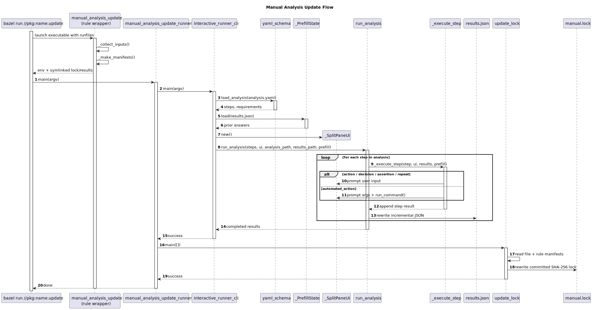
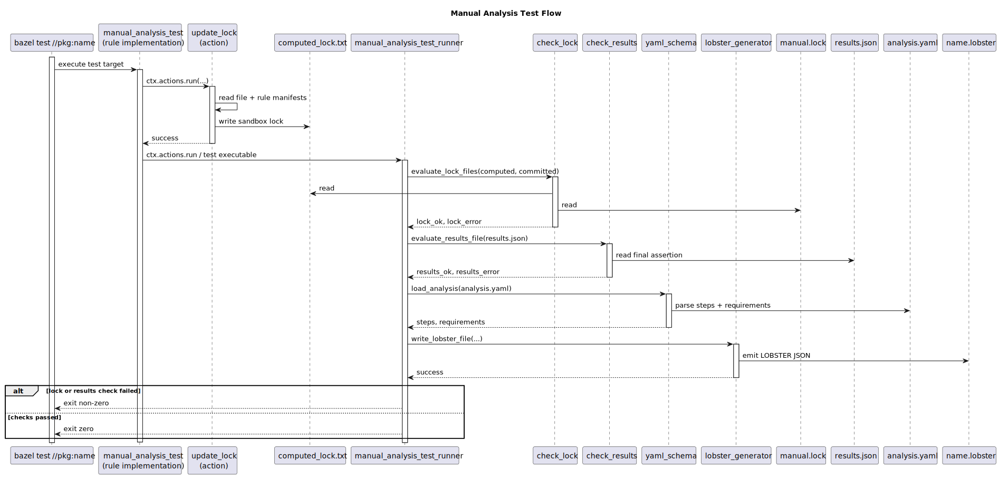
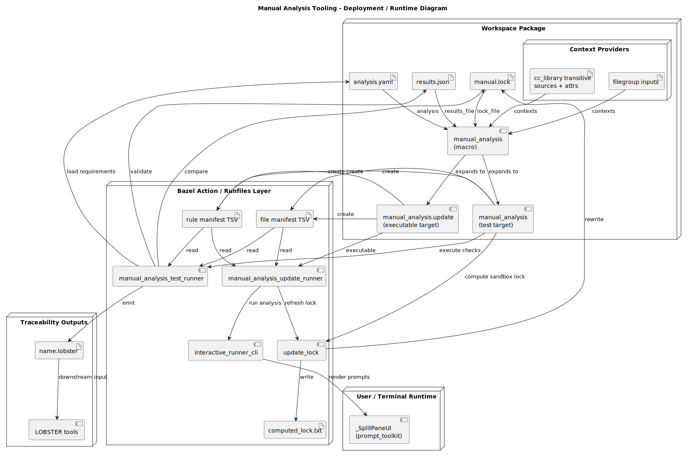
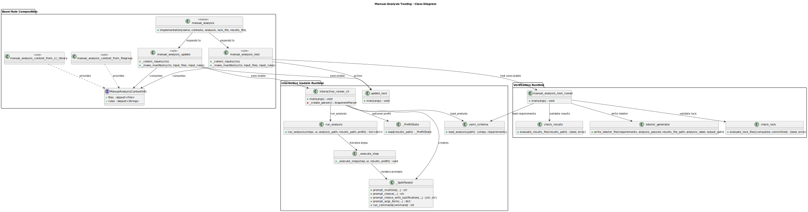

<!-- ----------------------------------------------------------------------------
  Copyright (c) 2026 Contributors to the Eclipse Foundation

  See the NOTICE file(s) distributed with this work for additional
  information regarding copyright ownership.

  This program and the accompanying materials are made available under the
  terms of the Apache License Version 2.0 which is available at
  https://www.apache.org/licenses/LICENSE-2.0

  SPDX-License-Identifier: Apache-2.0
----------------------------------------------------------------------------- -->

The following sequence diagrams show both flows separately so the Bazel rule
composition stays visible.

**Update flow:**



**Test flow:**



#### 1. Bazel Rule Composition Phase

The entry point is the `manual_analysis` macro in
[`manual_analysis/manual_analysis.bzl`](../manual_analysis.bzl). It composes two
concrete Bazel targets from one logical analysis definition:

- `{name}.update` → `manual_analysis_update`
- `{name}` → `manual_analysis_test`

Both rules share the same inputs:

- `contexts` — targets that provide `ManualAnalysisContextInfo`
- `analysis` — the YAML procedure definition
- `lock_file` — committed SHA-256 snapshot of the analysis context
- `results_file` — committed JSON result history of the interactive run

This composition is important because both runtime paths operate on the same
logical inputs but with different execution semantics:

- **update** runs interactively in the workspace and rewrites committed files
- **test** runs as a Bazel test, computes a fresh lock in an action, and checks
  the committed files for drift

#### 2. Context Collection Phase

The Bazel rules normalize all context sources behind the
`ManualAnalysisContextInfo` provider:

- `manual_analysis_context_from_filegroup` exposes arbitrary files unchanged
- `manual_analysis_context_from_cc_library` traverses a `cc_library` dependency
  graph and records both files and selected rule attributes
- project-specific rules can provide the same provider contract

The shared helper `_collect_inputs()` merges:

- context files from all providers
- the analysis YAML
- the committed results file

`_make_manifests()` then writes two deterministic manifests:

- **file manifest** — maps display paths to runtime paths for hashing
- **rule manifest** — serialized canonical rule attributes that also influence
  the lock file

That makes the lock sensitive to both source contents and relevant build
configuration, not just raw files.

#### 3. Update Flow

The `manual_analysis_update` rule prepares a runnable workspace-oriented target:

- creates runfile symlinks for the committed lock and results file
- publishes manifest and file locations through environment variables
- delegates execution to `manual_analysis_update_runner`

The update runner performs two phases in order:

1. `interactive_runner_cli.main()` loads the analysis YAML via `load_analysis()`,
   restores optional prefill state from the previous `results.json`, launches
   `_SplitPaneUI`, and drives `run_analysis()`.
2. `update_lock.main()` reads the generated manifests and rewrites the committed
   lock file using deterministic SHA-256 digests.

During `run_analysis()` each step is executed through `_execute_step()`:

- `action` → free-form reviewer notes
- `automated_action` → argument collection plus shell command execution
- `decision` / `assertion` → constrained answers with optional justification
- `repeat` → nested iteration until the break answer is selected

After every completed step, `results.json` is rewritten so interrupted runs still
leave a structured partial result behind.

#### 4. Test Flow

The `manual_analysis_test` rule separates **computation** from **verification**:

1. A Bazel action runs `update_lock` to generate a sandbox-local
   `computed_lock.txt` from the manifests.
2. A second Bazel action runs `manual_analysis_test_runner` with:
    - the computed lock
    - the committed lock
    - the analysis YAML
    - the committed results file
    - the Bazel label of the analysis target
    - the declared `.lobster` output path

`manual_analysis_test_runner` then:

- calls `evaluate_lock_files()` to detect stale analyses
- calls `evaluate_results_file()` to ensure the final assertion passed
- loads `requirements` from the analysis YAML via `load_analysis()`
- emits a `.lobster` artifact through `write_lobster_file()`

The `.lobster` file is generated even when checks fail inside the Bazel action,
so traceability tooling can still consume the verification outcome.

#### 5. Deployment / Runtime View

The deployment view below emphasizes how Bazel targets, manifests, Python entry
points, and committed workspace files fit together.



The most relevant runtime artifacts are:

- **analysis YAML** — procedure and requirement references
- **file manifest / rule manifest** — normalized hashing inputs
- **results JSON** — persisted reviewer answers and command outcomes
- **lock file** — deterministic digest of context plus rule state
- **LOBSTER JSON** — traceability output for downstream reporting

---

## Developer Guide

### Module Structure

| Module / Rule                    | Responsibility                                                                     |
|----------------------------------|------------------------------------------------------------------------------------|
| `manual_analysis` macro          | Expands one logical analysis into update and test targets                          |
| `manual_analysis_update` rule    | Prepares runfiles and environment for interactive execution plus lock refresh      |
| `manual_analysis_test` rule      | Computes a sandbox lock, validates committed artifacts, and produces `.lobster`    |
| `ManualAnalysisContextInfo`      | Provider contract for all context sources                                          |
| `yaml_schema.py`                 | Parses the analysis YAML into typed step objects and requirement lists             |
| `interactive_runner_cli.py`      | CLI entry point for interactive execution                                          |
| `interactive_runner_flow.py`     | Orchestrates step execution and incremental `results.json` writes                  |
| `interactive_runner_steps.py`    | Executes `action`, `automated_action`, `decision`, `assertion`, and `repeat` steps |
| `interactive_runner_ui_split.py` | Split-pane `prompt_toolkit` UI used during update runs                             |
| `update_lock.py`                 | Computes deterministic SHA-256 lock content from manifests                         |
| `check_lock.py`                  | Compares computed and committed lock files                                         |
| `check_results.py`               | Validates that the final assertion in `results.json` passed                        |
| `manual_analysis_test_runner.py` | Unified verification runner and LOBSTER emission entry point                       |
| `lobster_generator.py`           | Serializes the verification outcome to LOBSTER JSON                                |

### Architecture Diagrams

**Class structure:**



**Deployment / runtime:**


### Bazel Composition Model

The rule composition in [`manual_analysis/manual_analysis.bzl`](../manual_analysis.bzl)
can be summarized as:

```starlark
manual_analysis(
    name = "my_analysis",
    contexts = [...],
    analysis = "analysis.yaml",
    lock_file = "manual.lock",
    results_file = "results.json",
)
```

which expands to:

```starlark
manual_analysis_update(name = "my_analysis.update", ...)
manual_analysis_test(name = "my_analysis", ...)
```

Both rules reuse the same `_COMMON_ATTRS` and input collection helpers so the
interactive and verification paths stay aligned.

### Provider Contract

Every context-provider rule must return `ManualAnalysisContextInfo`:

```starlark
ManualAnalysisContextInfo(
    files = depset(...),
    rules = depset(...),
)
```

- `files` contributes source inputs to the lock computation
- `rules` contributes canonicalized rule attributes that should also invalidate
  the lock when build configuration changes

This makes the manual-analysis lock stronger than a plain file checksum.

### Update Runner Contract

`manual_analysis_update` passes these runtime paths through environment
variables:

- `MANUAL_ANALYSIS_FILES_MANIFEST`
- `MANUAL_ANALYSIS_RULES_MANIFEST`
- `MANUAL_ANALYSIS_LOCK_FILE`
- `MANUAL_ANALYSIS_YAML`
- `MANUAL_ANALYSIS_RESULTS_FILE`

`manual_analysis_update_runner.py` then executes:

```text
interactive_runner_main(argv)
update_lock_main([])
```

So the committed lock is only refreshed after the interactive flow completed.

### Test Runner Contract

`manual_analysis_test` wires two environments:

- an **action environment** with absolute paths for Bazel actions
- a **runfiles environment** with short paths for the test executable itself

The verification runner expects:

- `MANUAL_ANALYSIS_COMPUTED_LOCK`
- `MANUAL_ANALYSIS_COMMITTED_LOCK`
- `MANUAL_ANALYSIS_YAML`
- `MANUAL_ANALYSIS_RESULTS_FILE`
- `MANUAL_ANALYSIS_LOBSTER_OUTPUT`
- `MANUAL_ANALYSIS_LABEL`

This keeps the rule logic in Starlark while leaving the policy checks in Python.

### Example Package Layout

The example in [`manual_analysis/example/BUILD`](../example/BUILD) shows the
complete composition:

- one context from a `filegroup`
- one context from a transitive `cc_library`
- one `manual_analysis(...)` instance
- downstream `lobster_trlc` / `lobster_test` integration

That example is the best reference when adding a new manual analysis to another
package.
