<!-- ----------------------------------------------------------------------------
  Copyright (c) 2026 Contributors to the Eclipse Foundation

  See the NOTICE file(s) distributed with this work for additional
  information regarding copyright ownership.

  This program and the accompanying materials are made available under the
  terms of the Apache License Version 2.0 which is available at
  https://www.apache.org/licenses/LICENSE-2.0

  SPDX-License-Identifier: Apache-2.0
----------------------------------------------------------------------------- -->

# PlantUML Linker

The **linker** reads FlatBuffers `.fbs.bin` files produced by the PlantUML parser and generates a `plantuml_links.json` file consumed by the [`clickable_plantuml`](../sphinx/clickable_plantuml/) Sphinx extension to make diagrams interactive.

## How It Works

```
.puml files
    │
    ▼
┌──────────┐     ┌────────────┐     ┌──────────────────────┐     ┌──────────────────┐
│  Parser  │ ──▶ │ .fbs.bin   │ ──▶ │      Linker          │ ──▶ │ plantuml_links   │
│ (puml_cli)│     │ (FlatBuf)  │     │ (cross-diagram match)│     │     .json        │
└──────────┘     └────────────┘     └──────────────────────┘     └──────────────────┘
                                                                         │
                                                                         ▼
                                                                 ┌──────────────────┐
                                                                 │ clickable_plantuml│
                                                                 │ (Sphinx extension)│
                                                                 └──────────────────┘
```

### Supported Diagram Types

| Diagram Type | File ID | What Is Extracted |
|---|---|---|
| **Component** (`COMP`) | Alias, name, FQN (`id`), parent hierarchy, and relation targets |
| **Class** (`CLSD`) | Entity name, FQN (`id`), diagram name, and relationship sources/targets |
| **Sequence** (`SEQD`) | Unique participants (callers and callees from interactions) |

### Link Generation Algorithm

1. **Parse** each `.fbs.bin` file, detecting the diagram type by its 4-byte file identifier at bytes 4–7.
2. **Build an index** of top-level aliases — components/entities with no parent — mapped to their source `.puml` file. Both the PlantUML alias and the FQN (`id`) are registered as index keys, along with any distinct `name`.
3. **Register diagram names** (from `@startuml <name>`) as virtual top-level aliases, enabling cross-diagram linking by title.
4. **Extract relationship targets**: relation targets from component diagrams and relationship sources/targets from class diagrams are added as linkable elements.
5. **Match**: for each element alias in diagram A, if a top-level entry with the same name exists in diagram B, emit a link `A → B`.
6. **Deduplicate** and keep one target per alias (PlantUML supports only one `url of` per alias).

### Output Format

```json
{
  "links": [
    {
      "source_file": "overview.puml",
      "source_id": "MyComponent",
      "target_file": "my_component_detail.puml"
    }
  ]
}
```

## Usage

```bash
bazel run //plantuml/linker -- \
  --fbs-files path/to/*.fbs.bin \
  --output plantuml_links.json \
  --log-level info
```

### Arguments

| Argument | Default | Description |
|---|---|---|
| `--fbs-files` | *(required)* | One or more `.fbs.bin` FlatBuffer files to process |
| `--output` | `plantuml_links.json` | Output JSON file path |
| `--log-level` | `warn` | Log verbosity: `error`, `warn`, `info`, `debug`, `trace` |

## Build & Test

```bash
# Build
bazel build //plantuml/linker

# Build with Clippy lint
bazel build //plantuml/linker --config=clippy

# Run tests
bazel test //plantuml/linker:linker_test
```

## Linking Examples

### Component ↔ Component (alias match)

A top-level component in one diagram links to its detailed view in another:

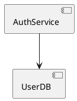

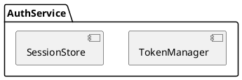

**Result:** `AuthService` in `overview.puml` becomes clickable → navigates to `auth_detail.puml`.

### Component ↔ Sequence (participant match)

Sequence diagram participants link back to component diagrams that define them:

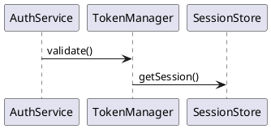

**Result:** `AuthService`, `TokenManager`, and `SessionStore` in `login_flow.puml` become clickable → navigate to `auth_detail.puml` (where they are top-level components).

### Class ↔ Class (relationship target)

Relationship targets in class diagrams link to the diagram where the target class is defined:

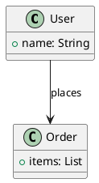

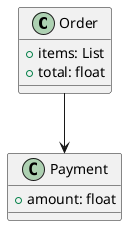

**Result:** `Order` in `models.puml` becomes clickable → navigates to `order_detail.puml`. `Payment` extracted from the relationship also becomes linkable.

### FQN / ID match

When a component's fully qualified `id` (e.g. `auth.TokenManager`) is indexed, diagrams referencing that FQN can match even when the PlantUML alias differs:

```plantuml
' system.puml — component with id "auth.TokenManager", alias "TokenManager"
```

Other diagrams with a top-level element named `auth.TokenManager` will link to `system.puml`.

### Diagram name match

A diagram's `@startuml <name>` title acts as a virtual alias:

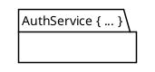

Any component with alias `auth_detail` in another diagram links to `auth_detail.puml`.

### Component name + alias (both registered)

When a component has both an `alias` and a distinct `name`, both are registered as linkable elements:

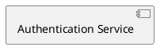

**Result:** Both `AuthSvc` (alias) and `Authentication Service` (name) are indexed. A component named `Authentication Service` in another diagram will link here.

### Component relation targets

Dependency arrows extract their targets as linkable elements, even when the target isn't explicitly declared as a separate component:

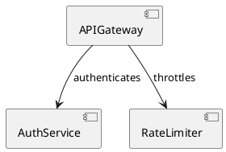

**Result:** `AuthService` and `RateLimiter` are extracted from relation targets. If either is a top-level component in another diagram, the arrow target becomes clickable.

### Class ↔ Component (cross-type linking)

Class entity names are matched against component aliases across diagram types:

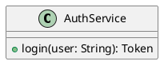


**Result:** `AuthService` in `system_overview.puml` becomes clickable → navigates to `class_model.puml` (where it is defined as a class entity).

### Sequence ↔ Class (cross-type linking)

Sequence diagram participants match class entity names from class diagrams:

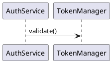

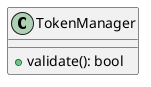

**Result:** `TokenManager` in `login_flow.puml` becomes clickable → navigates to `token_classes.puml`.

## Related Changes

The linker works in concert with two other modified components:

- **`puml_serializer` ([class_serializer.rs](../parser/puml_serializer/src/serialize/class_serializer.rs))**: Prepends the actual source filename to the serialized `source_files` vector so the linker can correlate class diagrams with their `.puml` file.

- **`clickable_plantuml` ([clickable_plantuml.py](../sphinx/clickable_plantuml/clickable_plantuml.py))**: Extended alias formatting to accept hyphens and dots in element identifiers (e.g., `my-component`, `pkg.Class`), enabling `url of` directives for FQN-style names.
