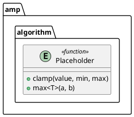

<!-- ----------------------------------------------------------------------------
  Copyright (c) 2026 Contributors to the Eclipse Foundation

  See the NOTICE file(s) distributed with this work for additional
  information regarding copyright ownership.

  This program and the accompanying materials are made available under the
  terms of the Apache License Version 2.0 which is available at
  https://www.apache.org/licenses/LICENSE-2.0

  SPDX-License-Identifier: Apache-2.0
----------------------------------------------------------------------------- -->

# Class Diagram Support Guide

This guide describes class-diagram syntax that has specific semantic meaning in
the PlantUML parser and resolver.

## Free functions

Use an `entity` with the `<<function>>` stereotype to group free functions.
The entity is a syntactic container only and is omitted from the resolved
class-diagram model. Its methods resolve as free functions in the enclosing
namespace.

This resolves to the free functions `amp.algorithm.clamp` and `amp.algorithm.max`.
Visibility markers such as `+` are accepted for PlantUML compatibility and do not
affect free-function semantics.

The parser currently preserves only the entity's name, namespace, package,
stereotypes, and methods. Entity-level template parameters, `extends` and
`implements` clauses, attributes, and `using` type aliases are not represented
in the entity model. The grammar may accept these constructs, but the parser
silently drops them, so do not rely on them. Use method-level template
parameters for templated free functions.

An `entity` without `<<function>>` is not modeled as a class-diagram entity.
Use the corresponding PlantUML declaration (`class`, `interface`, or `struct`)
to model those element kinds. The `entity <<function>>` handling is a focused
extension for grouping free functions, not a general substitute for those
declarations.
