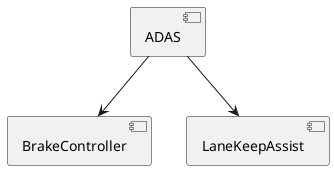
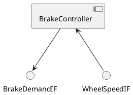

<!-- ----------------------------------------------------------------------------
  Copyright (c) 2026 Contributors to the Eclipse Foundation

  See the NOTICE file(s) distributed with this work for additional
  information regarding copyright ownership.

  This program and the accompanying materials are made available under the
  terms of the Apache License Version 2.0 which is available at
  https://www.apache.org/licenses/LICENSE-2.0

  SPDX-License-Identifier: Apache-2.0
----------------------------------------------------------------------------- -->
# clickable_plantuml

Sphinx extension that makes PlantUML diagrams clickable by injecting hyperlinks into rendered SVG/PNG diagrams.

## Sphinx Integration

The extension hooks into the native Sphinx build lifecycle.  URLs are computed by
`app.builder.get_relative_uri()`, which works for any builder and
output directory layout.

```
Sphinx build lifecycle                   clickable_plantuml hooks
═══════════════════════════════════      ═══════════════════════════════════════

  builder-inited                   ───► on_builder_inited()
  │  (one-time setup)                     Load all *plantuml_links.json files
  │                                       from srcdir (recursive).
  │                                       Store {puml_basename → alias_map}
  │                                       in app.env.
  │
  ├─ READ PHASE ──────────────────────────────────────────────────────────────
  │  for each document:
  │    env-purge-doc               ───► on_env_purge_doc()
  │    │  (incremental rebuild)          Remove stale puml→docname entries
  │    │                                 for the document being re-read.
  │    │
  │    parse RST → doctree
  │    │
  │    doctree-read                ───► on_doctree_read()
  │       (per document)                 Traverse the parsed doctree.
  │                                      For every plantuml node that has a
  │                                      filename attribute, record
  │                                      {puml_basename → docname} in app.env.
  │                                      Warn on basename collisions.
  │
  │  env-merge-info                ───► on_env_merge_info()
  │  (parallel builds only)              Merge puml→docname maps gathered
  │                                      by worker sub-processes into the
  │                                      main environment.
  │
  ├─ WRITE PHASE ─────────────────────────────────────────────────────────────
  │  for each document:
  │    post-transform / resolve
  │    │
  │    doctree-resolved            ───► on_doctree_resolved()
  │       (per document)                 For each plantuml node, look up the
  │                                      alias_map from app.env.
  │                                      Resolve target .puml → docname, then
  │                                      call app.builder.get_relative_uri()
  │                                      to get the correct relative URL.
  │                                      Append  url of <alias> is [[url]]
  │                                      directives to node['uml'] before
  │                                      sphinxcontrib-plantuml renders it.
  │
  build-finished
```

## How It Works

1. **Link discovery** (`builder-inited`) – Scans for `*plantuml_links.json` files in the Sphinx source directory.
2. **Diagram location mapping** (`doctree-read`) – As Sphinx reads each document, the extension traverses the parsed doctree to record which `docname` contains which `.puml` diagram (keyed by basename). Basename collisions across documents are reported as warnings.
3. **URL resolution & link injection** (`doctree-resolved`) – For each plantuml node, resolves target `.puml` references to the docname that contains the target diagram, generates a relative URL via `app.builder.get_relative_uri()`, and appends `url of <alias> is [[url]]` directives to the PlantUML source before rendering.
4. **Incremental / parallel support** – `env-purge-doc` removes stale entries when a document is re-read; `env-merge-info` merges state from parallel worker processes.

## Automatic JSON Generation (Bazel)

`plantuml_links.json` is generated by the `architectural_design()` rule.

The `architectural_design()` rule invokes `//tools/plantuml/linker:linker` on all
`.fbs.bin` FlatBuffers files produced by the PlantUML parser.  See
[Link Generation by the Linker](#link-generation-by-the-linker) for a detailed
description of which links are emitted.

### Algorithm

Given the set of `.fbs.bin` files for one `architectural_design()` target:

1. **Build a top-level index** – For each diagram, collect every component whose
   `parent_id` is `None` (i.e. it is not nested inside another component).
   The index maps `alias → diagram file`.

2. **Emit links** – For every component in every diagram, look up its alias in
   the top-level index.  If a *different* diagram defines that alias as a
   top-level component, emit a link entry:

   ```
   source_file = diagram that contains the reference
   source_id   = alias of the component
   target_file = diagram that defines it as a top-level component
   ```

3. **Deduplicate** – Sort and deduplicate so that each `(source_file, source_id)`
   pair has exactly one target (first alphabetically).  Duplicate `source_id`
   entries within the same source diagram are removed because PlantUML's
   `url of X is [[…]]` directive supports only one URL per alias.

### Concrete Example





Generated links — one in each direction:

```json
{
  "links": [
    {
      "source_file": "adas_overview.puml",
      "source_id":   "BrakeController",
      "target_file": "brake_controller.puml"
    },
    {
      "source_file": "brake_controller.puml",
      "source_id":   "BrakeController",
      "target_file": "adas_overview.puml"
    }
  ]
}
```

Clicking `BrakeController` in the overview navigates to its detail diagram;
clicking it in the detail diagram navigates back to the overview.

`ADAS` and `LaneKeepAssist` appear as top-level only in `adas_overview.puml` and
have no dedicated detail diagram, so **no links** are emitted for them.

## Link Mapping Format

Place one or more `*plantuml_links.json` filesinside the Sphinx source directory:

```json
{
  "links": [
    {
      "source_file": "my_diagram.puml",
      "source_id": "ComponentA",
      "target_file": "other_diagram.puml"
    }
  ]
}
```
