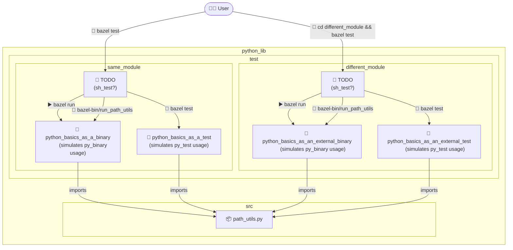

# Tests

## path_utils.py

path_utils behaves differently depending on how it is executed.
Therefore unit tests are not important, it's all about integration tests.

```mermaid
flowchart TD
    User(["👨‍💻 User"])

    subgraph python_lib
        subgraph src
            path_utils["📦 path_utils.py"]
        end

        subgraph test
            subgraph same_module
                run_path_utils["🔧 python_basics_as_a_binary
        (simulates py_binary usage)"]
                test_path_utils["🔧 python_basics_as_a_test
        (simulates py_test usage)"]
                actual_test["🧠 TODO
        (sh_test?)"]
            end
            subgraph different_module
                run_path_utils2["🔧 python_basics_as_an_external_binary
        (simulates py_binary usage)"]
                test_path_utils2["🔧 python_basics_as_an_external_test
        (simulates py_test usage)"]
                actual_test2["🧠 TODO
        (sh_test?)"]
            end
        end
    end
    run_path_utils -->|imports| path_utils
    test_path_utils -->|imports| path_utils
    actual_test -->|▶️ bazel run| run_path_utils
    actual_test -->|📂 bazel-bin/run_path_utils | run_path_utils
    actual_test -->|🧪 bazel test| test_path_utils

    run_path_utils2 -->|imports| path_utils
    test_path_utils2 -->|imports| path_utils
    actual_test2 -->|▶️ bazel run| run_path_utils2
    actual_test2 -->|📂 bazel-bin/run_path_utils | run_path_utils2
    actual_test2 -->|🧪 bazel test| test_path_utils2

    User -->|🧪 bazel test| actual_test
    User -->|🧪 cd different_module && bazel test| actual_test2
```
