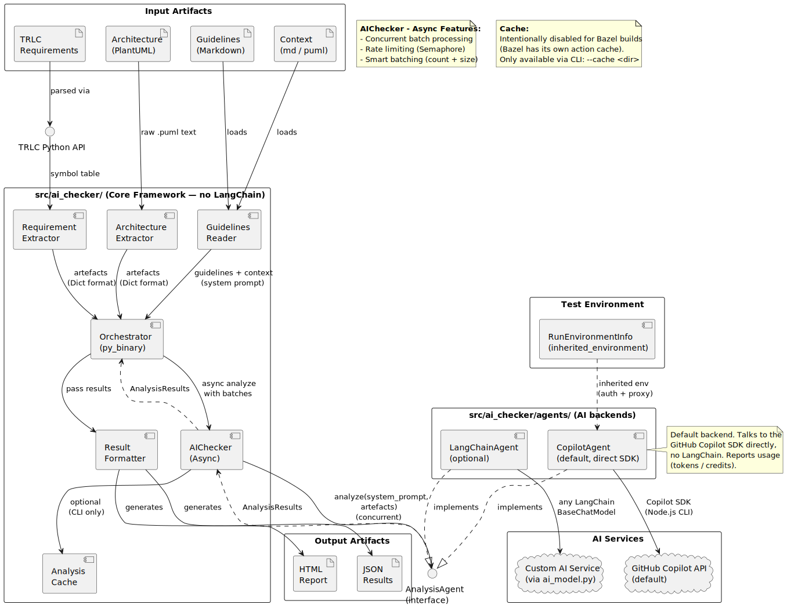
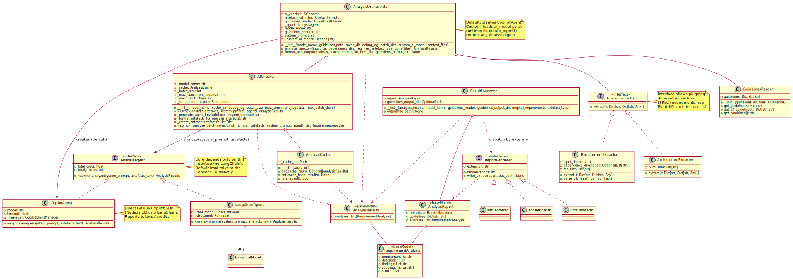

# AI Checker

AI-powered analysis tool for engineering artefacts against guidelines.

---

## User Guide

### What It Does

The AI Checker analyzes TRLC requirements and architectural design artefacts
against engineering guidelines using an AI model.  For each artefact it
produces:

- a list of **findings** (categorized as *Major* or *Minor*)
- a list of **suggestions** for improvement
- a numerical **quality score** from 0 to 10

Results are written as a JSON file and, optionally, an HTML report.

### Prerequisites

- A GitHub Copilot license (default backend) **or** a custom AI model
  (see [Custom AI Model](#custom-ai-model))
- Bazel

### Running a Check

Add a rule to your `BUILD` file and run it with `--config=copilot`:

```starlark
load("@score_tooling//validation/ai_checker:ai_checker.bzl", "trlc_requirements_ai_test")

trlc_requirements_ai_test(
    name = "requirements_ai_check",
    reqs = [":my_requirements"],
    score_threshold = "6.0",
    tags = ["manual"],
)
```

```bash
bazel test //path/to:requirements_ai_check --config=copilot
```

The `tags = ["manual"]` attribute is recommended to prevent the rule from
running during routine `bazel test //...` sweeps.

### Rule Reference

#### `trlc_requirements_ai_test`

Analyzes TRLC requirements against the built-in requirements engineering
guidelines.

```starlark
trlc_requirements_ai_test(
    name = "requirements_ai_check",
    reqs = [":my_requirements"],           # required: targets providing TrlcProviderInfo
    model = "anthropic/claude-sonnet-4-5", # optional: AI model to use
    score_threshold = "6.0",              # optional: minimum average score to pass (0–10)
    guidelines = "//my/org:guidelines",   # optional: override default guideline filegroup
    tags = ["manual"],
)
```

| Attribute | Description | Required | Default |
|-----------|-------------|----------|---------|
| `reqs` | Label list of targets providing `TrlcProviderInfo` | Yes | — |
| `model` | AI model identifier | No | `"anthropic/claude-sonnet-4-5"` |
| `score_threshold` | Minimum average score (0–10) to pass the test | No | `"0.0"` |
| `guidelines` | Filegroup of guideline markdown files | No | `default_guidelines` |

#### `architecture_ai_test`

Analyzes architectural design artefacts against the built-in architecture
guidelines.

```starlark
architecture_ai_test(
    name = "architecture_ai_check",
    designs = [":my_architectural_design"],  # required: targets providing ArchitecturalDesignInfo
    model = "anthropic/claude-sonnet-4-5",
    score_threshold = "6.0",
    tags = ["manual"],
)
```

| Attribute | Description | Required | Default |
|-----------|-------------|----------|---------|
| `designs` | Label list of targets providing `ArchitecturalDesignInfo` | Yes | — |
| `model` | AI model identifier | No | `"anthropic/claude-sonnet-4-5"` |
| `score_threshold` | Minimum average score (0–10) to pass the test | No | `"0.0"` |
| `guidelines` | Filegroup of guideline markdown files | No | `default_architecture_guidelines` |

### Output

Each test rule produces two output files:

| File | Content |
|------|---------|
| `<name>_analysis.json` | Machine-readable results (scores, findings, suggestions) |
| `<name>_analysis.html` | Interactive HTML report |

The HTML report shows a color-coded score card per artefact, linked guideline
reference pages, and summary statistics.  Both files land in `bazel-bin/`.

### Debug Output

To inspect the raw prompt sent to the AI model:

```bash
bazel test //path/to:requirements_ai_check --config=copilot --output_groups=debug
cat bazel-bin/path/to/requirements_ai_check_debug.log
```

### Custom AI Model

To use a provider other than GitHub Copilot, point `_custom_ai_model` at a
`py_binary` or `py_library` target that exposes a `create_chat_model()` function:

```starlark
trlc_requirements_ai_test(
    name = "requirements_ai_check",
    reqs = [":my_requirements"],
    _custom_ai_model = "//my/org:ai_model_py",
)
```

See the [Integration Guide](#integration-guide) for details on implementing a
[Integration Guide](#integration-guide) for full details.

---

## Integration Guide

This section describes how to use the AI Checker from another Bazel repository
(e.g., a consumer workspace that references this repo via a Bazel registry or
`git_repository`).

### Step 1 — Import the Bazel Config

Add this line to your root `.bazelrc` to pull in the Copilot environment
configuration:

```text
try-import %workspace%/.bazelrc.ai_checker
```

Copy `.bazelrc.ai_checker` from this repository into your workspace root.
It forwards the authentication and proxy variables the Copilot CLI needs
into Bazel's sandbox:

```text
build:copilot --action_env=HOME
build:copilot --action_env=COPILOT_GITHUB_TOKEN
build:copilot --action_env=GH_TOKEN
build:copilot --action_env=GITHUB_TOKEN
build:copilot --action_env=HTTP_PROXY
build:copilot --action_env=HTTPS_PROXY
build:copilot --action_env=NO_PROXY
build:copilot --action_env=http_proxy
build:copilot --action_env=https_proxy
build:copilot --action_env=no_proxy
```

**Why `--config=copilot`?**
Bazel sandboxes strip the host environment by default.  The Copilot SDK's
Node.js CLI needs `HOME` (for stored OAuth tokens) and proxy variables (to
reach `api.github.com`) to be explicitly forwarded.  These are scoped to
`config:copilot` so they do not affect other build actions.

**Authentication** — at least one of the following must be available inside
the sandbox:

| Variable | Purpose |
|----------|---------|
| `COPILOT_GITHUB_TOKEN` | Explicit token — recommended for CI |
| `GH_TOKEN` | GitHub CLI compatible |
| `GITHUB_TOKEN` | GitHub Actions compatible |
| `HOME` | Lets the CLI find stored OAuth credentials in `~/.copilot/` |

### Step 2 — Declare Bazel Targets

```starlark
load("@score_tooling//validation/ai_checker:ai_checker.bzl",
     "trlc_requirements_ai_test",
     "architecture_ai_test")

# Analyze TRLC requirements
trlc_requirements_ai_test(
    name = "requirements_ai_check",
    reqs = [":my_requirements"],           # target providing TrlcProviderInfo
    model = "anthropic/claude-sonnet-4-5",
    score_threshold = "6.0",              # fail if average score < 6.0
    tags = ["manual"],                    # recommended: exclude from //...
)

# Analyze architectural designs
architecture_ai_test(
    name = "architecture_ai_check",
    designs = [":my_architectural_design"],  # target providing ArchitecturalDesignInfo
    model = "anthropic/claude-sonnet-4-5",
    score_threshold = "6.0",
    tags = ["manual"],
)
```

**Manual tag recommendation:** Adding `tags = ["manual"]` prevents accidental
AI analysis runs during routine `bazel test //...` sweeps.  Run AI tests
by targeting them explicitly:

```bash
bazel test //path/to:requirements_ai_check --config=copilot
```

| Attribute | Description | Required | Default |
|-----------|-------------|----------|---------|
| `reqs` / `designs` | Targets providing `TrlcProviderInfo` or `ArchitecturalDesignInfo` | Yes | — |
| `model` | AI model identifier | No | `"anthropic/claude-sonnet-4-5"` |
| `score_threshold` | Minimum average score (0–10) to pass | No | `"0.0"` |
| `guidelines` | Custom guideline filegroup | No | `default_guidelines` / `default_architecture_guidelines` |

### Overriding Guidelines

Each rule uses a default `guidelines` filegroup.  Override per target to
supply organisation-specific rules:

```starlark
trlc_requirements_ai_test(
    name = "my_ai_check",
    reqs = [":my_requirements"],
    guidelines = "//my/org:custom_guidelines",
)
```

### Custom AI Model (Bazel)

To substitute a different AI backend at the Bazel level, provide a
`_custom_ai_model` attribute pointing to your `ai_model.py` file:

```starlark
trlc_requirements_ai_test(
    name = "requirements_ai_check",
    reqs = [":my_requirements"],
    _custom_ai_model = "//my/org:ai_model_py",
)
```

The file must expose `create_chat_model(model_name, max_completion_tokens)`.

### Debug Output

To inspect the raw input sent to the AI model and response timing:

```bash
bazel build //path/to:requirements_ai_check --config=copilot --output_groups=debug
cat bazel-bin/path/to/requirements_ai_check_debug.log
```

The debug log contains:
- Python version, model name, and guidelines path
- Batch processing information
- Complete system message (guidelines) and human message (artefacts)
- Response timing and token cost statistics

---

## Developer Guide

### Architecture

The AI Checker is organized into two source layers and one extension point:

| Directory | Purpose |
|-----------|---------|
| `src/ai_checker/` | Core analysis framework (extraction, scoring, caching, reporting). Depends on `langchain-core` for the `BaseChatModel` interface. |
| `src/copilot_adapter/` | `ChatCopilot` — LangChain `BaseChatModel` wrapper for the GitHub Copilot SDK. |

### Diagrams

**Deployment overview:**



**Class relationships:**



### Key Components

#### `AIChecker` (`src/ai_checker/ai_checker_core.py`)

Performs the async AI analysis.  Responsibilities:

- Splits artefacts into batches (by count via `--batch-size` and by total
  character length via `--max-batch-chars`)
- Processes batches concurrently, rate-limited by an `asyncio.Semaphore`
- Calls `BaseChatModel.with_structured_output(AnalysisResults).ainvoke()`
- Manages the optional result cache (`AnalysisCache`)

#### `ChatCopilot` (`src/copilot_adapter/copilot_langchain.py`)

A full `BaseChatModel` implementation backed by the GitHub Copilot SDK CLI
(a Node.js binary).  Provides:

- Standard LangChain message types (system, human, AI, tool)
- Tool calling via `bind_tools()`
- Structured output via `with_structured_output()`
- Native async generation (`_agenerate`) and a sync bridge (`_generate`)
- Pre-flight checks: CLI binary presence, executable bit, `HOME`, proxy vars
- Post-start authentication verification via `get_auth_status()`

**Why a separate adapter package?**
The `rules_python` wheel packaging strips the executable bit from the
Copilot CLI binary.  `ChatCopilot` locates the executable copy created by
the `pip.whl_mods / copy_executables` mechanism and provides clear
diagnostic messages when the environment is misconfigured.  The package is
named `copilot_adapter` (not `langchain`) to avoid shadowing the real
`langchain` PyPI package when `imports = ["src"]` is active in Bazel.

#### `RequirementExtractor` (`src/ai_checker/requirement_extractor.py`)

Parses TRLC files using the TRLC Python API and returns artefacts as
`dict[str, dict[str, Any]]`.  Only objects whose source file resides under
the `--input` directory are analyzed; objects from `--deps` directories are
loaded solely for link resolution.

#### `AnalysisOrchestrator` (`src/ai_checker/orchestrator.py`)

Top-level coordinator.  Instantiates the extractor, guidelines reader, AI
checker, and result formatter; wires them together; and exposes the CLI
entry point (`main()`).

#### `GuidelinesReader` (`src/ai_checker/guidelines_reader.py`)

Reads all `*.md` files from a flat guidelines directory and concatenates
them into the system-message string sent to the AI model.

#### `ResultFormatter` (`src/ai_checker/result_formatter.py`)

Formats `AnalysisResults` as JSON or HTML.  The HTML report generates
per-guideline markdown subpages linked from the main report.

### Caching Design

`AnalysisCache` keys results by `SHA-256(artefacts_json + guidelines + model_name)`.
It is **only** usable via the CLI `--cache` flag.  The Bazel rule deliberately
omits `--cache` because Bazel's action cache provides equivalent re-use without
breaking hermeticity.

### Adding a New Artefact Type

1. Subclass `ArtefactExtractor` (`src/ai_checker/artefact_extractor.py`) and
   implement `extract() -> dict[str, dict[str, Any]]`.
2. Instantiate your extractor in `AnalysisOrchestrator.analyze_directory()`
   based on the input file types detected.
3. Add a corresponding Bazel rule in `ai_checker.bzl` following the pattern of
   `_trlc_requirements_ai_test_impl`.

### Updating Python Dependencies

```bash
# Core + Copilot SDK dependencies
bazel run //validation/ai_checker:requirements.update
```
